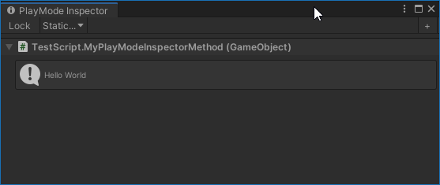
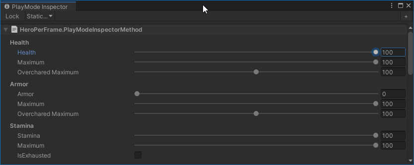

# PlayMode Inspector for Unity

PlayMode Inspector allows you to draw EditorGUI from inside your MonoBehaviour to a dedicated editor window: The PlayMode Inspector window.

When I write program code, such as new MonoBehaviour, I often want to visualize part of its internal state.

This helps me to understand what it's really doing, what is especially important during development and thus allows me to iterate on features and fix bugs faster than not knowing.

Such internal state is mostly interesting for developers. I don't want to expose it to the regular Unity Inspector, where everybody working on the project gets then annoyed and perhaps overwhelmed by it.

I don't want to write a custom Editor for every MonoBehaviour.

I don't want to create or use an overly complex Inspector system and specify how to visualize certain things using a gazillion interconnected attributes. Been there, not my thing.

For me, it's much simpler if I can just write EditorGUI code directly inside the MonoBehaviour with an `#if UNITY_EDITOR #endif` block around.

Writing the EditorGUI code inside the MonoBehaviour allows me to access private and non-serialized variables. Internal state most of the time is just that.

I came up with the PlayMode Inspector idea in 2015 and it proved to be a very useful tool all the time. I hope you find it equally useful.


# Installation

In order to use PlayMode Inspector, you have to add the package to your project. As of Unity 2019.3, Unity supports to add packages from git through the Package Manager window.

In Unity's Package Manager, choose "Add package from git URL" and insert one of the Package URL's you can find below.

## Package URL's

| Version  |     Link      |
|----------|---------------|
| 1.1.0 | https://github.com/pschraut/UnityPlayModeInspector.git#1.1.0 |
| 1.0.0 | https://github.com/pschraut/UnityPlayModeInspector.git#1.0.0 |


# How it works

When you open the PlayMode Inspector from Unity's main menu "Window > Analysis > PlayMode Inspector", you are presented with a rather empty window that has no functionality yet.


In order for it to show something, you need to implement a parameterless method either in your MonoBehaviour , ScriptableObject or a static method in any type.

You then decorate this method with the `[PlayModeInspectorMethod]` attribute.
```csharp
[Oddworm.Framework.PlayModeInspectorMethod]
void MyPlayModeInspectorMethod()
{
}
```
You can have as many `[PlayModeInspectorMethod]` methods in the same class as you want.

Since this is supposed to be used in the Unity editor only and actually uses editor-only functionality from the `UnityEditor` namespace, I put the code inside an `#if UNITY_EDITOR #endif` block as shown below.

```csharp
[Oddworm.Framework.PlayModeInspectorMethod]
void MyPlayModeInspectorMethod()
{
#if UNITY_EDITOR
    UnityEditor.EditorGUILayout.HelpBox("Hello World", UnityEditor.MessageType.Info);
#endif
}
```

If you then select the GameObject that contains a MonoBehaviour with the above method, it ends up in PlayMode Inspector as shown below.



`[PlayModeInspectorMethod]` methods, while they're shown in the PlayMode Inspector window, are called periodically. More precisely, they are called 10 times per second.

# Examples

Below you can find a few examples how I use PlayMode Inspector.

Along with every example, I provide further information about the context and describe why I implemented it that way, to give you an idea how and where you could use it.

## Example - Hello World

Let's start with a Hello World example first.

If you decorate a method with the `[PlayModeInspectorMethod]`, it instructs the PlayMode Inspector window to call that method periodically (draw the EditorGUI), when you select the GameObject with that particular MonoBehaviour.


```csharp
using UnityEngine;

public class TestScript : MonoBehaviour
{
    [Oddworm.Framework.PlayModeInspectorMethod]
    void MyPlayModeInspectorMethod()
    {
#if UNITY_EDITOR
        UnityEditor.EditorGUILayout.HelpBox("Hello World", UnityEditor.MessageType.Info);
#endif
    }
}
```


## Example - Instance Method
The following code snippet is a real-world application of PlayMode Inspector. It shows how to expose an instance method to PlayMode Inspector.

It's part of an AwardManager class and displays the progress of each Award. It provides buttons to advance the progress of an Award, for testing purposes. This allows me to test whether an Award unlocks, without actually playing the game. It's a great way to test a first implementation and to cheat during development.


```csharp
[Oddworm.Framework.PlayModeInspectorMethod]
void PlayModeInspectorMethod()
{
#if UNITY_EDITOR
    // Draw a progressbar for each award and cheat buttons to advance the award progress.
    for (var n = 0; n < GetCount(); ++n)
    {
        UnityEditor.EditorGUILayout.BeginHorizontal();

        // Get a reference to the award
        var award = GetAward(n);
		
        // Draw the reference to the Award
        UnityEditor.EditorGUILayout.ObjectField(award, typeof(Award), false);

        // Draw the award progress
        UnityEditor.EditorGUI.ProgressBar(GUILayoutUtility.GetRect(100, GUI.skin.button.CalcHeight(new GUIContent("Wg"), 100)), 
            award.NormalizedProgress, 
            string.Format("{0} / {1} ({2:F2}%)", award.Progress, award.TriggerValue, award.NormalizedProgress));

        // Draw button to trigger award progression 1 time
        if (GUILayout.Button("+1", GUILayout.Width(30)))
        {
            Award.Editor.Trigger(award);
        }

        // Draw button to trigger award progression 5 times
        if (GUILayout.Button("+5", GUILayout.Width(30)))
        {
            for (var j = 0; j < 5; ++j)
                Award.Editor.Trigger(award);
        }
		
        // Draw button to trigger award progression 10 times
        if (GUILayout.Button("+10", GUILayout.Width(35)))
        {
            for (var j = 0; j < 10; ++j)
                Award.Editor.Trigger(award);
        }

        UnityEditor.EditorGUILayout.EndHorizontal();
        GUILayout.Space(2);
    }
#endif // UNITY_EDITOR
}
```


## Example - Static Method

The following code snippet is a real-world application of PlayMode Inspector. It shows how to expose a static method to PlayMode Inspector.

The Player (Hero) class in that particular game writes many of its attributes once per frame to a global static class named HeroPerFrame. The silent agreement with that HeroPerFrame class is that only the Hero code writes to it, all other code reads from it only. 

For example: The Hero writes its current Health values to this class, once per frame. Other code, such as the HUD, read from it. It's a very simple one-way data exchange approach. I like to keep things simple.

The PlayMode Inspector method in HeroPerFrame then displays its variables, the actual Hero attributes. In this case, it not only displays them, but even allows to change them!

This "pattern" allows me to test the HUD code, that drives the UI, without having to play the game. This works, because if the Hero class that is normally responsible to write to HeroPerFrame doesn't exist, only the PlayMode Inspector method is actually modifying the variables.

Other code, such as the HUD, only read those values and don't care from where they come.

This allows me to only load the HUD scene without all the other game around, press Play and modify via the PlayMode Inspector the HeroPerFrame variables and the HUD updates accordingly, like the game would normally run.

I can test how the HUD code drives the UI, when I change the Health, Stamina, etc values without having to play. This made it really compfortable for me to implement and iterate on a lot of HUD code.



```csharp
using UnityEngine;

// Hero class writes to HeroPerFrame, all other classes must read from it only.
// This is to keep data exchange very simple.
public static class HeroPerFrame
{
    public static int Health;
    public static int HealthMaximum;
    public static int OvercharedMaximumHealth;

    public static int Armor;
    public static int ArmorMaximum;
    public static int OvercharedMaximumArmor;

    public static int Stamina;
    public static int StaminaMaximum;
    public static bool IsExhausted;
	
    // ... and many many more attributes
	
    [Oddworm.Framework.PlayModeInspectorMethod]
    static void PlayModeInspectorMethod()
    {
#if UNITY_EDITOR
        UnityEditor.EditorGUILayout.LabelField("Health", UnityEditor.EditorStyles.boldLabel);
        UnityEditor.EditorGUI.indentLevel++;
        Health = UnityEditor.EditorGUILayout.IntSlider("Health", Health, 0, OvercharedMaximumHealth);
        HealthMaximum = UnityEditor.EditorGUILayout.IntSlider("Maximum", HealthMaximum, 0, 100);
        OvercharedMaximumHealth = UnityEditor.EditorGUILayout.IntSlider("Overchared Maximum", OvercharedMaximumHealth, 0, 200);
        UnityEditor.EditorGUI.indentLevel--;

        GUILayout.Space(4);
        UnityEditor.EditorGUILayout.LabelField("Armor", UnityEditor.EditorStyles.boldLabel);
        UnityEditor.EditorGUI.indentLevel++;
        Armor = UnityEditor.EditorGUILayout.IntSlider("Armor", Armor, 0, OvercharedMaximumArmor);
        ArmorMaximum = UnityEditor.EditorGUILayout.IntSlider("Maximum", ArmorMaximum, 0, 100);
        OvercharedMaximumArmor = UnityEditor.EditorGUILayout.IntSlider("Overchared Maximum", OvercharedMaximumArmor, 0, 200);
        UnityEditor.EditorGUI.indentLevel--;

        GUILayout.Space(4);
        UnityEditor.EditorGUILayout.LabelField("Stamina", UnityEditor.EditorStyles.boldLabel);
        UnityEditor.EditorGUI.indentLevel++;
        Stamina = UnityEditor.EditorGUILayout.IntSlider("Stamina", Stamina, 0, StaminaMaximum);
        StaminaMaximum = UnityEditor.EditorGUILayout.IntSlider("Maximum", StaminaMaximum, 0, 100);
        IsExhausted = UnityEditor.EditorGUILayout.Toggle("IsExhausted", IsExhausted);
        UnityEditor.EditorGUI.indentLevel--;
#endif
    }
}
```
